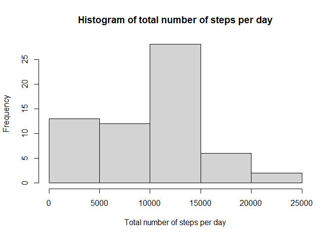
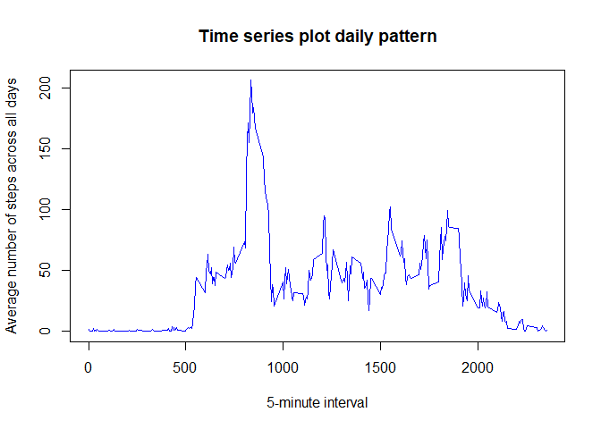
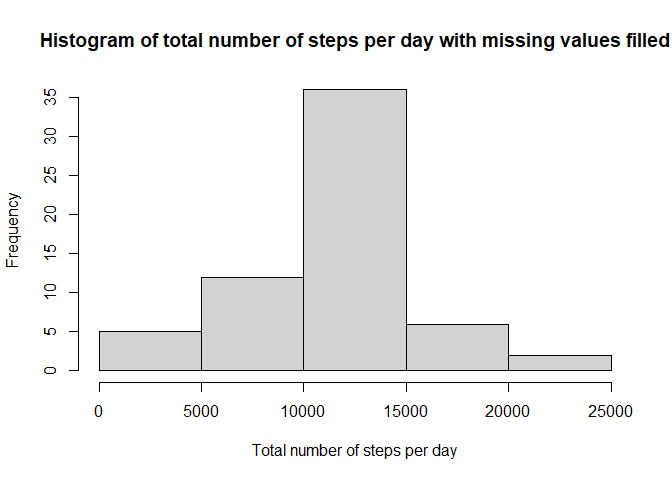
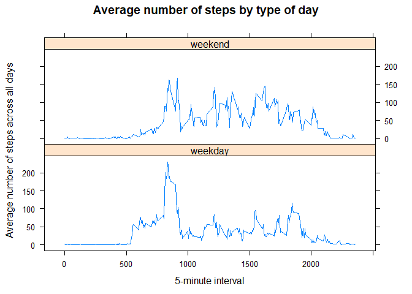

## Loading and preprocessing the data

Package loading, unzip and load the .csv file.

```r
library(lubridate)
library(dplyr)
library(lattice)
Sys.setlocale("LC_TIME", "English")
```

```
## [1] "English_United States.1252"
```

```r
unzip("activity.zip")
act<-read.csv("activity.csv")
act$date<-ymd(act$date)
str(act)
```

```
## 'data.frame':	17568 obs. of  3 variables:
##  $ steps   : int  NA NA NA NA NA NA NA NA NA NA ...
##  $ date    : Date, format: "2012-10-01" "2012-10-01" ...
##  $ interval: int  0 5 10 15 20 25 30 35 40 45 ...
```


## What is mean total number of steps taken per day?

### 1. Total number of steps taken per day:

```r
sumPerDay<-tapply(act$steps,act$date,sum,na.rm=T)
sumPerDay
```

```
## 2012-10-01 2012-10-02 2012-10-03 2012-10-04 2012-10-05 2012-10-06 2012-10-07 
##          0        126      11352      12116      13294      15420      11015 
## 2012-10-08 2012-10-09 2012-10-10 2012-10-11 2012-10-12 2012-10-13 2012-10-14 
##          0      12811       9900      10304      17382      12426      15098 
## 2012-10-15 2012-10-16 2012-10-17 2012-10-18 2012-10-19 2012-10-20 2012-10-21 
##      10139      15084      13452      10056      11829      10395       8821 
## 2012-10-22 2012-10-23 2012-10-24 2012-10-25 2012-10-26 2012-10-27 2012-10-28 
##      13460       8918       8355       2492       6778      10119      11458 
## 2012-10-29 2012-10-30 2012-10-31 2012-11-01 2012-11-02 2012-11-03 2012-11-04 
##       5018       9819      15414          0      10600      10571          0 
## 2012-11-05 2012-11-06 2012-11-07 2012-11-08 2012-11-09 2012-11-10 2012-11-11 
##      10439       8334      12883       3219          0          0      12608 
## 2012-11-12 2012-11-13 2012-11-14 2012-11-15 2012-11-16 2012-11-17 2012-11-18 
##      10765       7336          0         41       5441      14339      15110 
## 2012-11-19 2012-11-20 2012-11-21 2012-11-22 2012-11-23 2012-11-24 2012-11-25 
##       8841       4472      12787      20427      21194      14478      11834 
## 2012-11-26 2012-11-27 2012-11-28 2012-11-29 2012-11-30 
##      11162      13646      10183       7047          0
```

### 2. Histogram of the total number of steps in each day:

```r
hist(sumPerDay,xlab = "Total number of steps per day",main = "Histogram of total number of steps per day")
```

<!-- -->

### 3. Mean and median of the total number of steps taken per day:

#### 3.1. Mean per day:

```r
meanPerDay<-tapply(act$steps,act$date,mean,na.rm=T)
meanPerDay
```

```
## 2012-10-01 2012-10-02 2012-10-03 2012-10-04 2012-10-05 2012-10-06 2012-10-07 
##        NaN  0.4375000 39.4166667 42.0694444 46.1597222 53.5416667 38.2465278 
## 2012-10-08 2012-10-09 2012-10-10 2012-10-11 2012-10-12 2012-10-13 2012-10-14 
##        NaN 44.4826389 34.3750000 35.7777778 60.3541667 43.1458333 52.4236111 
## 2012-10-15 2012-10-16 2012-10-17 2012-10-18 2012-10-19 2012-10-20 2012-10-21 
## 35.2048611 52.3750000 46.7083333 34.9166667 41.0729167 36.0937500 30.6284722 
## 2012-10-22 2012-10-23 2012-10-24 2012-10-25 2012-10-26 2012-10-27 2012-10-28 
## 46.7361111 30.9652778 29.0104167  8.6527778 23.5347222 35.1354167 39.7847222 
## 2012-10-29 2012-10-30 2012-10-31 2012-11-01 2012-11-02 2012-11-03 2012-11-04 
## 17.4236111 34.0937500 53.5208333        NaN 36.8055556 36.7048611        NaN 
## 2012-11-05 2012-11-06 2012-11-07 2012-11-08 2012-11-09 2012-11-10 2012-11-11 
## 36.2465278 28.9375000 44.7326389 11.1770833        NaN        NaN 43.7777778 
## 2012-11-12 2012-11-13 2012-11-14 2012-11-15 2012-11-16 2012-11-17 2012-11-18 
## 37.3784722 25.4722222        NaN  0.1423611 18.8923611 49.7881944 52.4652778 
## 2012-11-19 2012-11-20 2012-11-21 2012-11-22 2012-11-23 2012-11-24 2012-11-25 
## 30.6979167 15.5277778 44.3993056 70.9270833 73.5902778 50.2708333 41.0902778 
## 2012-11-26 2012-11-27 2012-11-28 2012-11-29 2012-11-30 
## 38.7569444 47.3819444 35.3576389 24.4687500        NaN
```

#### 3.2. Median per day:

```r
medianPerDay<-tapply(act$steps,act$date,median,na.rm=T)
medianPerDay
```

```
## 2012-10-01 2012-10-02 2012-10-03 2012-10-04 2012-10-05 2012-10-06 2012-10-07 
##         NA          0          0          0          0          0          0 
## 2012-10-08 2012-10-09 2012-10-10 2012-10-11 2012-10-12 2012-10-13 2012-10-14 
##         NA          0          0          0          0          0          0 
## 2012-10-15 2012-10-16 2012-10-17 2012-10-18 2012-10-19 2012-10-20 2012-10-21 
##          0          0          0          0          0          0          0 
## 2012-10-22 2012-10-23 2012-10-24 2012-10-25 2012-10-26 2012-10-27 2012-10-28 
##          0          0          0          0          0          0          0 
## 2012-10-29 2012-10-30 2012-10-31 2012-11-01 2012-11-02 2012-11-03 2012-11-04 
##          0          0          0         NA          0          0         NA 
## 2012-11-05 2012-11-06 2012-11-07 2012-11-08 2012-11-09 2012-11-10 2012-11-11 
##          0          0          0          0         NA         NA          0 
## 2012-11-12 2012-11-13 2012-11-14 2012-11-15 2012-11-16 2012-11-17 2012-11-18 
##          0          0         NA          0          0          0          0 
## 2012-11-19 2012-11-20 2012-11-21 2012-11-22 2012-11-23 2012-11-24 2012-11-25 
##          0          0          0          0          0          0          0 
## 2012-11-26 2012-11-27 2012-11-28 2012-11-29 2012-11-30 
##          0          0          0          0         NA
```


## What is the average daily activity pattern?

### 1. Time series plot of the 5-minute interval (x-axis) and the average number of steps taken, averaged across all days (y-axis)

```r
meanPerInterval<-tapply(act$steps,act$interval,mean,na.rm=T)
plot(names(meanPerInterval),meanPerInterval,type="l",xlab = "5-minute interval",ylab="Average number of steps across all days",main = "Time series plot daily pattern",col="blue")
```

<!-- -->

### 2. The 5-minute interval that contains the maximum number of steps on average across all the days in the dataset is:

```r
meanPerInterval<-data.frame(names(meanPerInterval),meanPerInterval)
subset(meanPerInterval$names.meanPerInterval.,meanPerInterval$meanPerInterval==max(meanPerInterval$meanPerInterval))
```

```
## [1] "835"
```


## Imputing missing values

### 1. Calculate and report the total number of missing values in the dataset

```r
naRows<-sum(is.na(act))
naRows
```

```
## [1] 2304
```

### 2. Devise a strategy for filling in all of the missing values in the dataset
The missing values will be filled with the mean of the 5 minute interval across all days.

### 3. Create a new dataset that is equal to the original dataset but with the missing data filled in.

```r
stepsFilled<-rep(0,nrow(act))
meanPerIntervalRep<-rep(meanPerInterval$meanPerInterval,nrow(act))
for (i in 1:nrow(act)) {
    if(is.na(act[i,1])) {
        stepsFilled[i]<-meanPerIntervalRep[i]
    }
    else {
        stepsFilled[i]<-act[i,1]
    }
}
actFilled<-data.frame(stepsFilled,act$date,act$interval)
names(actFilled)<-c("steps","date","interval")
str(actFilled)
```

```
## 'data.frame':	17568 obs. of  3 variables:
##  $ steps   : num  1.717 0.3396 0.1321 0.1509 0.0755 ...
##  $ date    : Date, format: "2012-10-01" "2012-10-01" ...
##  $ interval: int  0 5 10 15 20 25 30 35 40 45 ...
```

### 4. Calculations with the missing data filled

#### 4.1 Histogram of the total number of steps taken each day

```r
sumPerDayFilled<-tapply(actFilled$steps,actFilled$date,sum)
hist(sumPerDayFilled,xlab = "Total number of steps per day",main = "Histogram of total number of steps per day with missing values filled")
```

<!-- -->

#### 4.2 Mean total number of steps taken per day

```r
meanPerDayFilled<-tapply(actFilled$steps,actFilled$date,mean)
meanPerDayFilled
```

```
## 2012-10-01 2012-10-02 2012-10-03 2012-10-04 2012-10-05 2012-10-06 2012-10-07 
## 37.3825996  0.4375000 39.4166667 42.0694444 46.1597222 53.5416667 38.2465278 
## 2012-10-08 2012-10-09 2012-10-10 2012-10-11 2012-10-12 2012-10-13 2012-10-14 
## 37.3825996 44.4826389 34.3750000 35.7777778 60.3541667 43.1458333 52.4236111 
## 2012-10-15 2012-10-16 2012-10-17 2012-10-18 2012-10-19 2012-10-20 2012-10-21 
## 35.2048611 52.3750000 46.7083333 34.9166667 41.0729167 36.0937500 30.6284722 
## 2012-10-22 2012-10-23 2012-10-24 2012-10-25 2012-10-26 2012-10-27 2012-10-28 
## 46.7361111 30.9652778 29.0104167  8.6527778 23.5347222 35.1354167 39.7847222 
## 2012-10-29 2012-10-30 2012-10-31 2012-11-01 2012-11-02 2012-11-03 2012-11-04 
## 17.4236111 34.0937500 53.5208333 37.3825996 36.8055556 36.7048611 37.3825996 
## 2012-11-05 2012-11-06 2012-11-07 2012-11-08 2012-11-09 2012-11-10 2012-11-11 
## 36.2465278 28.9375000 44.7326389 11.1770833 37.3825996 37.3825996 43.7777778 
## 2012-11-12 2012-11-13 2012-11-14 2012-11-15 2012-11-16 2012-11-17 2012-11-18 
## 37.3784722 25.4722222 37.3825996  0.1423611 18.8923611 49.7881944 52.4652778 
## 2012-11-19 2012-11-20 2012-11-21 2012-11-22 2012-11-23 2012-11-24 2012-11-25 
## 30.6979167 15.5277778 44.3993056 70.9270833 73.5902778 50.2708333 41.0902778 
## 2012-11-26 2012-11-27 2012-11-28 2012-11-29 2012-11-30 
## 38.7569444 47.3819444 35.3576389 24.4687500 37.3825996
```

#### 4.3 Median total number of steps taken per day. 

```r
medianPerDayFilled<-tapply(actFilled$steps,actFilled$date,median)
medianPerDayFilled
```

```
## 2012-10-01 2012-10-02 2012-10-03 2012-10-04 2012-10-05 2012-10-06 2012-10-07 
##   34.11321    0.00000    0.00000    0.00000    0.00000    0.00000    0.00000 
## 2012-10-08 2012-10-09 2012-10-10 2012-10-11 2012-10-12 2012-10-13 2012-10-14 
##   34.11321    0.00000    0.00000    0.00000    0.00000    0.00000    0.00000 
## 2012-10-15 2012-10-16 2012-10-17 2012-10-18 2012-10-19 2012-10-20 2012-10-21 
##    0.00000    0.00000    0.00000    0.00000    0.00000    0.00000    0.00000 
## 2012-10-22 2012-10-23 2012-10-24 2012-10-25 2012-10-26 2012-10-27 2012-10-28 
##    0.00000    0.00000    0.00000    0.00000    0.00000    0.00000    0.00000 
## 2012-10-29 2012-10-30 2012-10-31 2012-11-01 2012-11-02 2012-11-03 2012-11-04 
##    0.00000    0.00000    0.00000   34.11321    0.00000    0.00000   34.11321 
## 2012-11-05 2012-11-06 2012-11-07 2012-11-08 2012-11-09 2012-11-10 2012-11-11 
##    0.00000    0.00000    0.00000    0.00000   34.11321   34.11321    0.00000 
## 2012-11-12 2012-11-13 2012-11-14 2012-11-15 2012-11-16 2012-11-17 2012-11-18 
##    0.00000    0.00000   34.11321    0.00000    0.00000    0.00000    0.00000 
## 2012-11-19 2012-11-20 2012-11-21 2012-11-22 2012-11-23 2012-11-24 2012-11-25 
##    0.00000    0.00000    0.00000    0.00000    0.00000    0.00000    0.00000 
## 2012-11-26 2012-11-27 2012-11-28 2012-11-29 2012-11-30 
##    0.00000    0.00000    0.00000    0.00000   34.11321
```

#### 4.4 Do these values differ from the estimates from the first part of the assignment? 
Yes, the values are different.

#### 4.5 What is the impact of imputing missing data on the estimates of the total daily number of steps?
There is an important impact specially in the range from 0 to 5000.


## Are there differences in activity patterns between weekdays and weekends?

### 1. Create a new factor variable in the dataset with two levels – “weekday” and “weekend” indicating whether a given date is a weekday or weekend day.

```r
weekendDay<-c("Saturday","Sunday")
dayType<-function(x){
    if (weekdays(x) %in% weekendDay) return("weekend")
    else return("weekday")
}
actFilled$dayType<-as.factor(sapply(actFilled$date,dayType))
str(actFilled)
```

```
## 'data.frame':	17568 obs. of  4 variables:
##  $ steps   : num  1.717 0.3396 0.1321 0.1509 0.0755 ...
##  $ date    : Date, format: "2012-10-01" "2012-10-01" ...
##  $ interval: int  0 5 10 15 20 25 30 35 40 45 ...
##  $ dayType : Factor w/ 2 levels "weekday","weekend": 1 1 1 1 1 1 1 1 1 1 ...
```

### 2. Make a panel plot containing a time series plot of the 5-minute interval (x-axis) and the average number of steps taken, averaged across all weekday days or weekend days (y-axis).

```r
actFilled$intervalDayType<-with(actFilled,paste(dayType,interval,sep="_"))
meanPerIntervalDayTypeFilled<-tapply(actFilled$steps,actFilled$intervalDayType,mean)
dayTypeInterval<-strsplit(names(meanPerIntervalDayTypeFilled),"_")
dayType<-sapply(dayTypeInterval,function(x) x[1])
interval<-sapply(dayTypeInterval,function(x) x[2])
byWd<-data.frame(as.integer(interval),meanPerIntervalDayTypeFilled,as.factor(dayType))
names(byWd)<-c("Interval","NumberOfSteps","dayType")
byWd<-arrange(byWd,Interval)
xyplot(NumberOfSteps~Interval | dayType,data=byWd,layout=c(1,2),type="l",xlab = "5-minute interval",ylab="Average number of steps across all days", main="Average number of steps by type of day")
```

<!-- -->

We can see that on weekday we got a higher pick than on weekend but during weekend we see more activity during the day than on weekday
